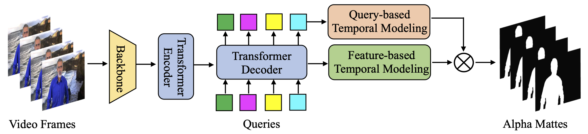
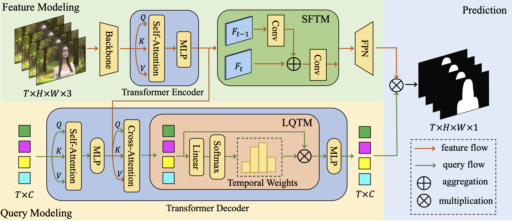
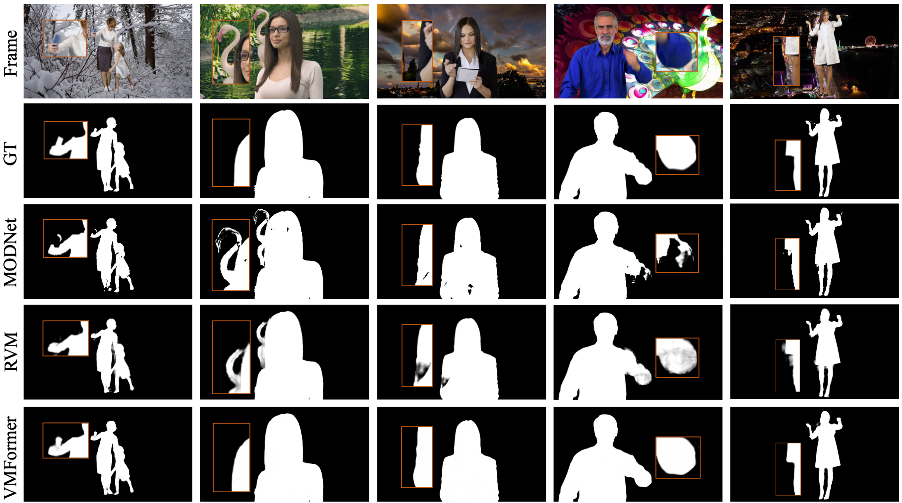

# VMFormer: End-to-End Video Matting with Transformer

[Jiachen Li](https://chrisjuniorli.github.io/), [Vidit Goel](https://vidit98.github.io/), Marianna Ohanyan, Shant Navasardyan, [Yunchao Wei](https://weiyc.github.io/), [Humphrey Shi](https://www.humphreyshi.com/)

[[`arXiv`](https://arxiv.org/abs/2208.12801)] [[`Project`](https://chrisjuniorli.github.io/project/VMFormer/)] [[`Code`](https://github.com/SHI-Labs/VMFormer)]

<div align="center">
  
</div><br/>

## News

Aug 25, 2022: [Codes](https://github.com/SHI-Labs/VMFormer) are released with [project page](https://chrisjuniorli.github.io/project/VMFormer/) and [arxiv version](https://arxiv.org/abs/2208.12801).

## Abstract

Video matting aims to predict the alpha mattes for each frame from a given input video sequence. Recent solutions to video matting have been dominated by deep convolutional neural networks (CNN) for the past few years, which have become the de-facto standard for both academia and industry. 
However, they have inbuilt inductive bias of locality and do not capture global characteristics of an image due to the CNN-based architectures. They also lack long range temporal modeling considering computational costs when dealing with feature maps of multiple frames. In this paper, we propose <b>VMFormer</b>: a transformer-based end-to-end method for video matting. It makes predictions on alpha mattes of each frame from learnable queries given a video input sequence. Specifically, it leverages self-attention layers to build global integration of feature sequences with short-range temporal modeling on successive frames. We further apply queries to learn global representations through cross-attention in the transformer decoder with long-range temporal modeling upon all queries. In the prediction stage, both queries and corresponding feature maps are used to make the final prediction of alpha matte. Experiments show that VMFormer outperforms previous CNN-based video matting methods on the composited benchmarks. To our best knowledge, it is the first end-to-end video matting solution built upon a full vision transformer with predictions on the learnable queries.

## Architecture

<div align="center">
  
</div><br/>

VMFormer contains two separate paths for modeling of features and queries: a) The feature modeling path contains a CNN-based backbone network to extract feature pyramids and a transformer encoder integrates feature sequences globally with short-range feature-based temporal modeling (SFTM). b) The query modeling path has a transformer decoder for queries to learn global representations of feature sequences and long-range query-based temporal modeling (LQTM) are built upon all queries. The final alpha mattes predictions based on matrix multiplication between queries and feature maps. LayerNorm, residual connection and repeated blocks are omitted for simplicity.

## Visualization

<div align="center">
  
</div><br/>

Visualization of alpha matte predictions from MODNet, RVM and VMFormer under challenging frames from the composited test set. VMFormer shows better ability to distinguish ambiguous foreground from background regions as shown in the magnified image patches.

## Installation

See [Installation Instructions](INSTALL.md).

## Getting Started

See [Getting Started](GETTING_STARTED.md).

## Model Zoo
| Model                                                        | MAD   | MSE | Grad | Conn  | dtSSD |
| ------------------------------------------------------------ | ---- | ---- | ---- | ---- | ---- |
| VMFormer [[google]](https://drive.google.com/file/d/1q2Rm-Rp42bQA4zIbCqPzJ9GG6P7SQGmq/view?usp=sharing) | 5.91 | 1.21 | 0.76 | 0.39 | 1.90 |

# To do List
- [x] PyTorch codes release
- [ ] Huggingface demo
- [ ] Colab demo

## Citation

```
@article{li2022vmformer,
      title={VMFormer: End-to-End Video Matting with Transformer}, 
      author={Jiachen Li and Vidit Goel and Marianna Ohanyan and Shant Navasardyan and Yunchao Wei and Humphrey Shi},
      journal={arXiv preprint},
      year={2022},
}
```

## Acknowledgement

This repo is based on [Deformable DETR](https://github.com/fundamentalvision/Deformable-DETR) and [SeqFormer](https://github.com/wjf5203/SeqFormer). Thanks for their open-sourced works.
