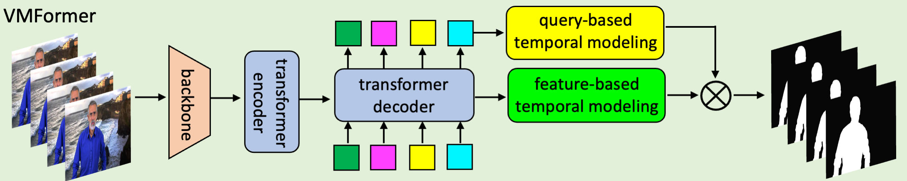
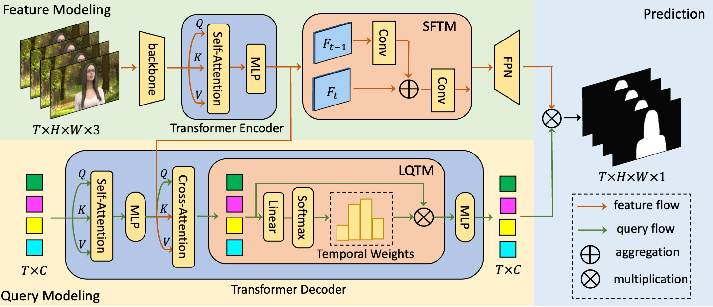

# VMFormer: End-to-End Video Matting with Transformer

[Jiachen Li](https://chrisjuniorli.github.io/), [Vidit Goel](https://vidit98.github.io/), Marianna Ohanyan, Shant Navasardyan, [Yunchao Wei](https://weiyc.github.io/), [Humphrey Shi](https://www.humphreyshi.com/)

[[`arXiv`]()] [[`Project`](https://chrisjuniorli.github.io/project/VMFormer/)] [[`Code`]()]

<div align="center">
  
</div><br/>

## News

Aug 25, 2022: [Codes]() are released with [project page](https://chrisjuniorli.github.io/project/VMFormer/) and [arxiv version]().

## Abstract

Video matting, which is to estimate alpha mattes for each frame of input video sequences. Solutions to video matting have been dominated by deep convolutional neural networks for the past few years, which has become the de-facto standard for both academia and industry. However, they still suffer from the inductive bias of CNN on local perception and the lack of long-range temporal modeling. In this paper, we propose <b>VMFormer</b>: a transformer-based end-to-end method that makes predictions on alpha mattes of each corresponding frame from learnable queries given a video input sequence. It leverages self-attention in the transformer encoder to build global integration of feature sequences and queries to learn global representations through cross-attention in the transformer decoder. We further apply long-range temporal modeling to all queries along with short-range temporal modeling on feature maps. Each query predicts alpha matte based on feature maps of each frame in the prediction stage. Experiments show that VMFormer outperforms previous CNN-based video matting methods and sets a new state-of-the-art. To our best knowledge, it is the first end-to-end video matting solution built upon a vision transformer with predictions on learnable queries.

## Architecture

<div align="center">
  
</div><br/>

VMFormer contains two separate paths for modeling of features and queries: a) The feature modeling path contains a CNN-based backbone network to extract feature pyramids and a transformer encoder integrates feature sequences globally with short-range feature-based temporal modeling (SFTM). b) The query modeling path has a transformer decoder for queries to learn global representations of feature sequences and long-range query-based temporal modeling (LQTM) are built upon all queries. The final alpha mattes predictions based on matrix multiplication between queries and feature maps. LayerNorm, residual connection and repeated blocks are omitted for simplicity.

## Visualization

<div align="center">
  
</div><br/>

Visualization of alpha matte predictions from MODNet, RVM and VMFormer under challenging frames from the composited test set. VMFormer shows better ability to distinguish ambiguous foreground from background regions as shown in the magnified image patches.

## Installation

See [Installation instructions](INSTALL.md).

## Getting Started

See [Getting Started](GETTING_STARTED.md).

## Model Zoo
| Model                                                        | MAD   | MSE | Grad | Conn  | dtSSD |
| ------------------------------------------------------------ | ---- | ---- | ---- | ---- | ---- |
| VMFormer [[google]](https://drive.google.com/file/d/1q2Rm-Rp42bQA4zIbCqPzJ9GG6P7SQGmq/view?usp=sharing) | 5.91 | 1.21 | 0.76 | 0.39 | 1.90 |

# To do List
- [x] PyTorch codes release
- [ ] Huggingface demo
- [ ] Colab demo

## Citation

```
@article{li2022vmformer,
      title={VMFormer: End-to-End Video Matting with Transformer}, 
      author={Jiachen Li and Vidit Goel and Marianna Ohanyan and Shant Navasardyan and Yunchao Wei and Humphrey Shi},
      journal={arXiv preprint},
      year={2022},
}
```

## Acknowledgement

This repo is based on [Deformable DETR](https://github.com/fundamentalvision/Deformable-DETR) and [SeqFormer](https://github.com/wjf5203/SeqFormer). Thanks for their open-sourced works.
